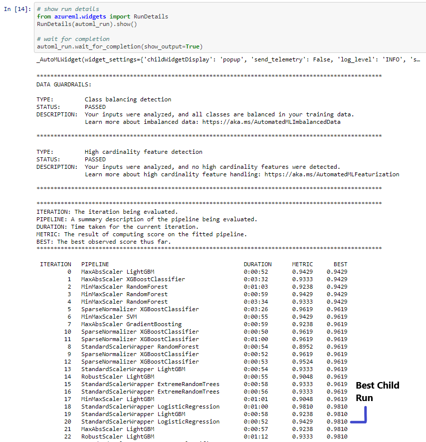
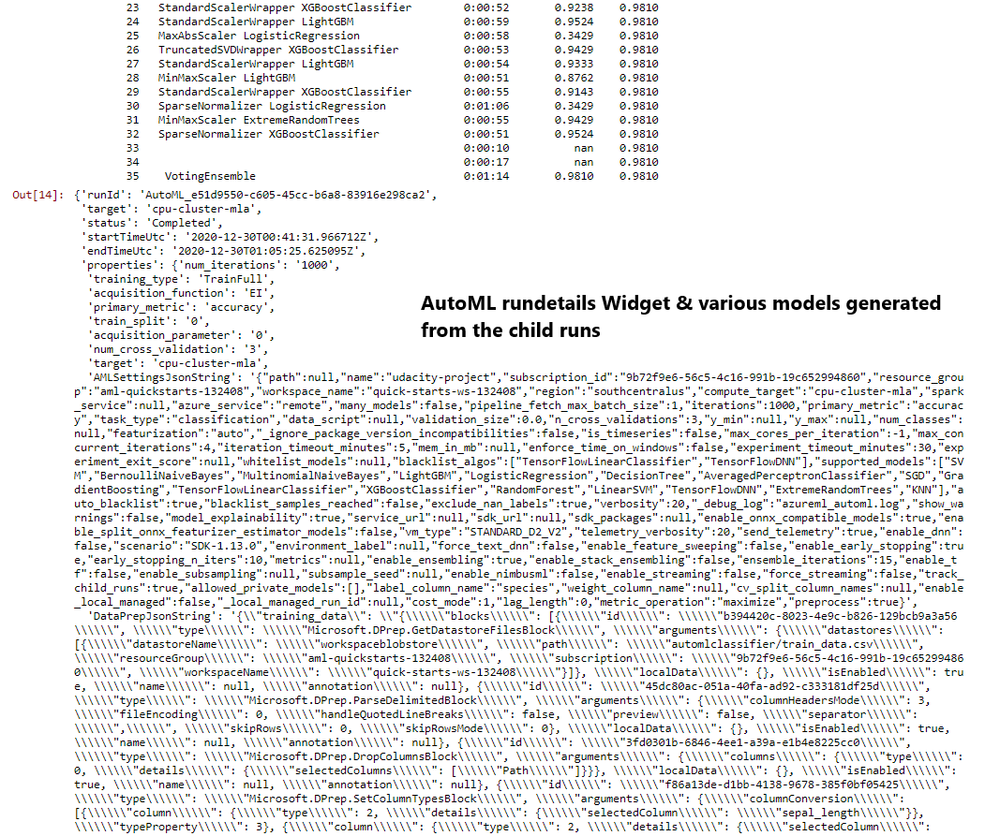
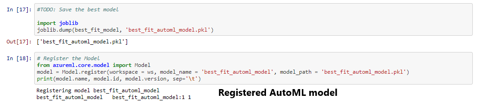
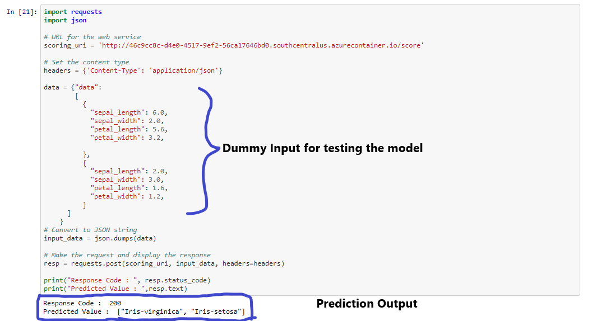
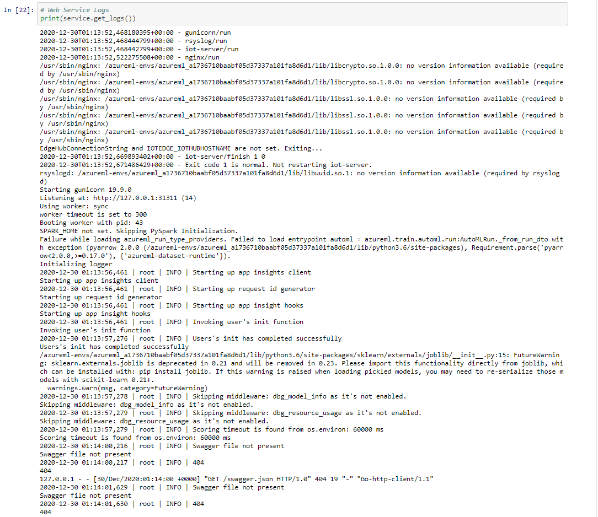

# Project Title -  Predicting IRIS Flower Species                                                                                                       

The Iris flower data set or Fisher's Iris data set is a multivariate data set introduced by the British statistician, eugenicist, and biologist Ronald Fisher. The data set consists of 50 samples from each of three species of Iris (Iris setosa, Iris virginica and Iris versicolor). Four features were measured from each sample: the length and the width of the sepals and petals, in centimeters. Based on the combination of these four features, Fisher developed a linear discriminant model to distinguish the species from each other.  
The Project is using the same dataset to train a ML model using Hyperdrive and AutoML runs, then deploy the best model as a Webservice in terms of Accuracy which has been chosen as the Primary metric. Finally we would test the Prediction capability of the model by calling the Webservice. 
Additionally we have enabled Application insight to view the detailed logs related to the requests being sent to the web app.

## Project Set Up and Installation
*OPTIONAL:* If your project has any special installation steps, this is where you should put it. To turn this project into a professional portfolio project, you are encouraged to explain how to set up this project in AzureML.

## Dataset

### Overview
The data set consists of 50 samples from each of three species of Iris (Iris setosa, Iris virginica and Iris versicolor). Four features were measured from each sample: the length and the width of the sepals and petals, in centimeters. 
1. Sepal Length 
2. Sepal Width 
3. Petal Length 
4. Petal Width 

Based on the combination of these four features the species of the flower is being determined. We have taken the IRIS data set from Kaggle and added the same to github repository. 
The dataset is accessed directly within Azure from github using Azure's TabularDatasetFactory

### Task
The project focuses on building a Classification Model.  
First we are training the Model using Hyperdrive and AutoML.  
Then we deploy the best model as a webservice which is being chosen based upon the Primary Metric - Accuracy score.  
Finally we would test the Prediction capability of the model by calling the Webservice. 
Additionally we have enabled Application insight to view the detailed logs related to the requests being sent to the web app. 

### Access
The dataset is accessed directly from github using Azure's TabularDatasetFactory

## Automated ML
### AutoML Settings
1. "enable_early_stopping" : True - Whether to enable early termination if the score is not improving in the short term. The default is False. 
2. "iteration_timeout_minutes": 5 - Maximum time in minutes that each iteration can run for before it terminates. If not specified, a value of 1 month or 43200 minutes is used. 
3. "max_concurrent_iterations": 4 - Represents the maximum number of iterations that would be executed in parallel. The default value is 1. 
4. "max_cores_per_iteration": -1 - The maximum number of threads to use for a given training iteration.   
5. "featurization": 'auto' - FeaturizationConfig Indicator for whether featurization step should be done automatically or not, or whether customized featurization should be used 
6. "verbosity": logging.INFO - The verbosity level for writing to the log file. The default is INFO or 20. 

### AutoML Configurations
1. experiment_timeout_minutes=30 - Maximum amount of time in minutes that all iterations combined can take before the experiment terminates. 
2. primary_metric - The metric that Automated Machine Learning will optimize for model selection 
3. n_cross_validations=3 - How many cross validations to perform when user validation data is not specified. 
4. debug_log = "automl_errors.log" - The log file to write debug information to. If not specified, 'automl.log' is used. 

### Results
### AUTOML RUNDETAILS WIDGET & DIFFERENT MODELS GENERATED 

### BEST TRAINED MODEL - VOTINGENSEMBLE - ACCURACY = 0.9905

### IMPROVEMENT OPPORTUNITIES
We have achieved maximum accuracy through VotingEnsemble = 0.9905.  
1. In AutoML run we can use the allowed_models or blocked_models parameters to further, modify iterations with the available models to include or exclude 
2. For classification, we can also enable deep learning. If deep learning is enabled, validation is limited to train_validation split.

## Hyperparameter Tuning
1. The machine learning model I have chosen to go along with hyperdrive is Support Vector Machine (SVM). 
2. Linear models have linear decision boundaries (intersecting hyperplanes) while the non-linear kernel models (polynomial or Gaussian RBF) have more flexible non-linear decision boundaries with shapes that depend on the kind of kernel and its parameters. 
3. In addition to performing linear classification, SVMs can efficiently perform a non-linear classification using what is called the kernel trick, implicitly mapping their inputs into high-dimensional feature spaces. 

# PARAMETERS
1. RandomParameterSampling - Random sampling supports discrete and continuous hyperparameters. It supports early termination of low-performance runs. 
### parameter_space
a) "--kernel": choice('linear', 'rbf', 'poly', 'sigmoid') - If we’re having a problem with an SVM model, it can be useful to run our data through the kernel to see if anything unexpected happens. 
#### Linear Kernel - Linear kernels compute similarity in the input space. They don’t implicitly define a transformation to higher dimensions. 
#### RBF Kernel - The RBF feature space has an infinite number of dimensions. We can build complex decision boundaries
#### Polynomial Kernel - The polynomial kernel allows us to learn patterns in our data as if we had access to the interaction features, which are the features that come from combining pre-existing features
#### Sigmoid Kernel - SVM model using a sigmoid kernel function is equivalent to a two-layer, perceptron neural network.

b) "--penalty": choice(0.5, 1, 1.5) - It tells the algorithm how much we care about misclassified points.  
2. primary_metric_name='Accuracy - Each training run is evaluated for the primary metric. The early termination policy uses the primary metric to identify low-performance runs. 

3. primary_metric_goal - It can be either PrimaryMetricGoal.MAXIMIZE or PrimaryMetricGoal.MINIMIZE and determines whether the primary metric will be maximized or minimized when evaluating the runs. 

4. max_concurrent_runs=4 - Maximum number of runs that can run concurrently. If not specified, all runs launch in parallel. If specified, must be an integer between 1 and 100. 

5. Specify early termination policy -Automatically terminate poorly performing runs with an early termination policy. Early termination improves computational efficiency. 

*TODO*: What kind of model did you choose for this experiment and why? Give an overview of the types of parameters and their ranges used for the hyperparameter search

### Results
# HYPERDRIVE RUNDETAILS WIDGET  

# BEST TRAINED MODEL - ACCURACY = 0.9778

### IMPROVEMENT OPPORTUNITIES

1. Instead of Random parameter sampling, we could use Grid sampling which would exhaustively search over the search space. Supports early termination of low-performance runs. Performs a simple grid search over all possible values. Grid sampling can, only be used with choice hyperparameters. 
2. For early termination policy we use Bandit policy, however we could also use additional parameters like slack_amount [The absolute distance allowed from the best performing run] and delay_evaluation [The number of intervals for which to delay the first policy evaluation. If specified, the policy applies every multiple of evaluation_interval that is greater than or equal to delay_evaluation.]. Although these are optional parameters.
3. The gamma parameter makes most intuitive sense when we think about the RBF (or Gaussian) kernel. The Gaussian class boundaries dissipate as they get further from the support vectors. The gamma parameter determines how quickly this dissipation happens; larger values decrease the effect of any individual support vector.

## Model Deployment
*TODO*: Give an overview of the deployed model and instructions on how to query the endpoint with a sample input.
### Best hyperdrive model has an Accuracy of 0.97778
### Best AutoML model [VotingEnsemble] has an accuracy of 0.99048
### Thus we would proceed with the deployment of the VotingEnsemble model
#### I have registered the best model :

#### Then deployed this model as a web service using ACI (Azure Container Instance). Screenshot shows the Scoring URI and the Swagger link

#### Below is the Screenshot of the Scoring/ Entry Script 

#### Below is the Screenshot showing how we are calling the Web App with sample data and what is the predicted result

## Screen Recording
*TODO* Provide a link to a screen recording of the project in action. Remember that the screencast should demonstrate:
- A working model
- Demo of the deployed  model
- Demo of a sample request sent to the endpoint and its response

## Standout Suggestions - OPTIONAL
### Enable logging in your deployed web app
#### Below is the Screenshot of the Scoring/ Entry Script 

#### Details logged and a screenshot of the logs and metrics collected.

